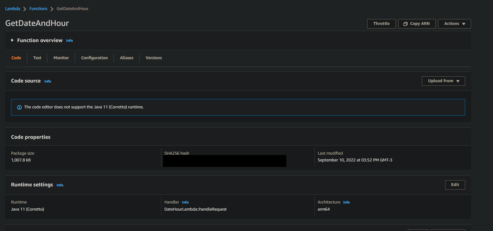
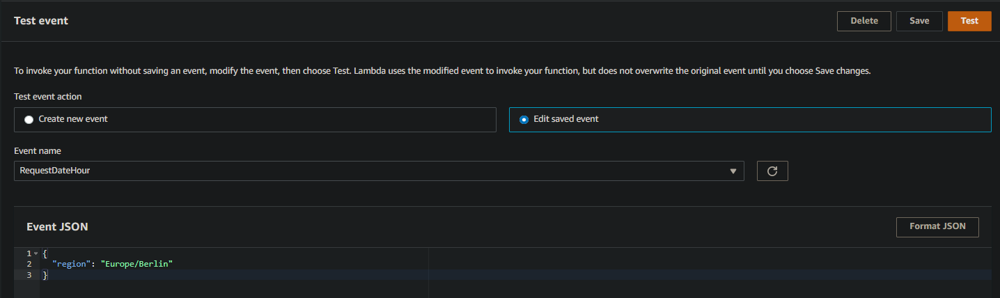
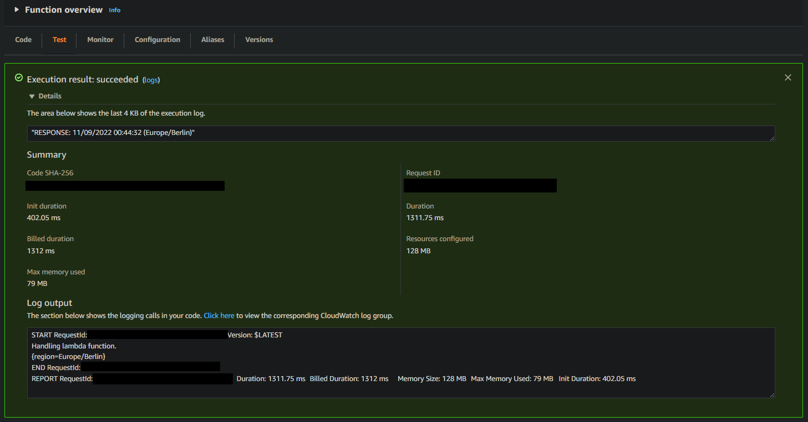
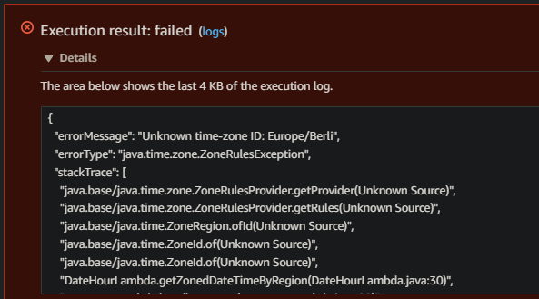

# date-hour-lambda-aws
A lamba project to handle request and return date and hour. 
The main purpose of this project is to learn about the **serverless** concept and run a simple project with no server configuration. 

## AWS Lambda
In this project, I've used the cloud provider AWS and Lambda service.

I created a function to run Java 11 and then created a simple Java project with Maven.

### Lambda Java Application
The application expects a request parameter `region` and returns the local date and time of the informed region.

Region examples:  'Europe/Lisbon', 'Europe/Madrid' and 'America/Sao_Paulo'.

### Lambda Function

With Maven, a `.jar` file (inside `target` folder) was generated and uploaded into the Lambda function, which is to say, the application was deployed.

* In the following print, it is shown the Lambda function configurations and properties. Notice that the **'Handler'** configuration is the path in the code where the method implemented by `RequestHandler`interface is called.

* The following 3 prints show the payload and the tests executed, one for a successful call and one for a failure.

* Success call.

* Error call. The informed region is incorrect.

